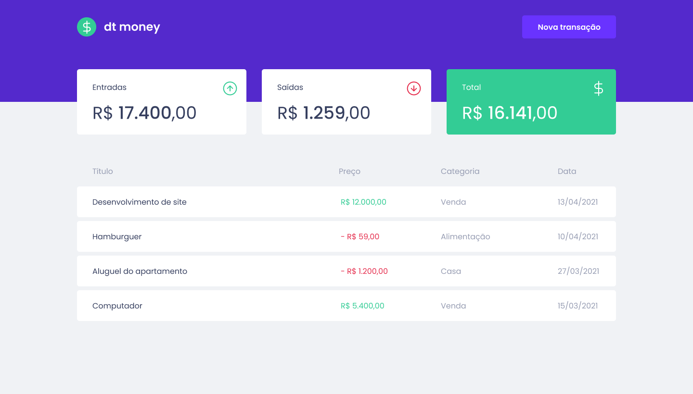

# 

# DtMoney - React App

<table>
<tr>
<td>
  Learning project of a React app to create and manage daily expense/income. Developed with Typescript.
</td>
</tr>
</table>

&nbsp;

## Available Scripts

In the project directory, you can run:

### `yarn start`

Runs the app in the development mode.\
Open [http://localhost:3000](http://localhost:3000) to view it in the browser.

The page will reload if you make edits.\
You will also see any lint errors in the console.
